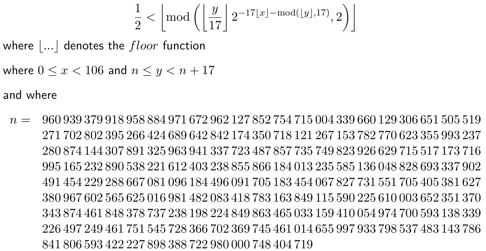
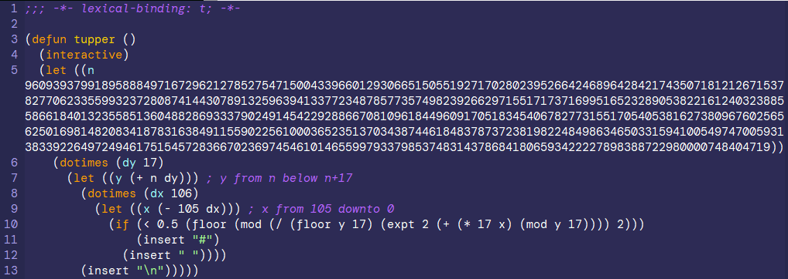
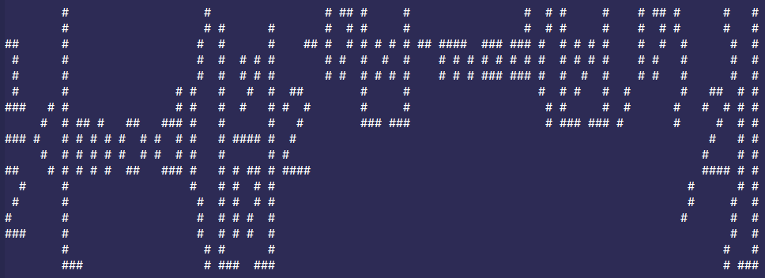

# elisp-problem-solving

This project uses Emacs Lisp to solve numeric puzzles as those proposed by Project Euler.

This is a personal, exploratory project with no fixed roadmap. Its aim is essentially to improve my skills. Development happens irregularly as time permits.

Solutions are proposed in Emacs Lisp using cl-lib, and also in "traditional" Emacs Lisp without cl-lib.

A test suite is proposed in `z_tests.el` file (instructions inside).

Table of contents:  
- [Project Euler](#project-euler)  
- [Tupper formula](#tupper-formula)

Any comment? Open an [issue](https://github.com/occisn/elisp-problem-solving/issues), or start a discussion [here](https://github.com/occisn/elisp-problem-solving/discussions) or [at profile level](https://github.com/occisn/occisn/discussions).

# Project Euler

Project Euler problems solved are: [1](https://projecteuler.net/problem=1), [2](https://projecteuler.net/problem=2), [3](https://projecteuler.net/problem=3), [4](https://projecteuler.net/problem=4), [5](https://projecteuler.net/problem=5), [6](https://projecteuler.net/problem=6), [7](https://projecteuler.net/problem=7), [9](https://projecteuler.net/problem=9), [10](https://projecteuler.net/problem=10).

# Tupper formula

Tupper's self-referential formula is a formula that visually represents itself when graphed on plane.

See [Wikipedia](https://en.wikipedia.org/wiki/Tupper%27s_self-referential_formula) or [Wolfram MathWorld](https://mathworld.wolfram.com/TuppersSelf-ReferentialFormula.html).

Formula:

SBCL supports 'big' integers, which allows implementing the formula directly:

Output:

I have added this code to [Rosetta Code](https://rosettacode.org/wiki/Tupper%27s_self-referential_formula).

(end of README)

